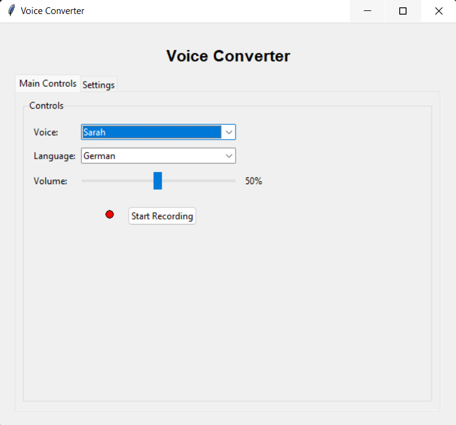
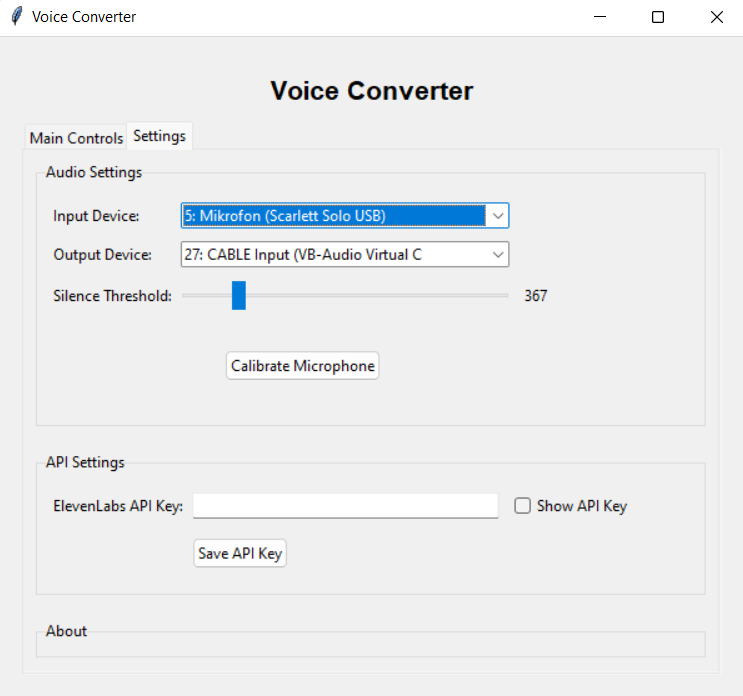

# Voice Converter

Voice Converter is a desktop application that transforms your voice into various synthetic voices in real-time. The application uses the ElevenLabs Speech-to-Speech API to enable high-quality voice conversion.

## Features

- **Real-time Voice Conversion**: Speak into your microphone and immediately hear the transformed voice
- **Extensive Voice Selection**: Access to all available ElevenLabs voices
- **Multilingual Support**: Supports 15+ languages for voice conversion
- **Customizable Audio Settings**: Choose preferred input and output devices
- **Automatic Speech Detection**: Intelligent detection of speech pauses and silence
- **User-friendly Interface**: Intuitive tabs for main controls and settings
- **Settings Persistence**: Your audio settings are saved between program starts

## Screenshots

  
*Main view of the Voice Converter application*

  
*Settings view with audio device configuration*

## Installation

### Prerequisites

- Python 3.7 or higher
- FFmpeg (must be available in the system path)

### Installation Options

#### Option 1: Install from GitHub
```bash
pip install git+https://github.com/pronicx/voice-converter.git
```

#### Option 2: Install from source
```bash
# Clone the repository
git clone https://github.com/pronicx/voice-converter.git
cd voice-converter

# Install the package
pip install .

# Or install in development mode
pip install -e .
```

### Installing Dependencies

#### Windows
```bash
pip install pipwin
pipwin install pyaudio
```

FFmpeg Installation:
```bash
# With winget
winget install ffmpeg

# Or download manually and add to path:
# https://ffmpeg.org/download.html
```

#### macOS
```bash
brew install portaudio ffmpeg
pip install pyaudio
```

#### Linux (Ubuntu/Debian)
```bash
sudo apt-get install python3-dev portaudio19-dev ffmpeg
pip install pyaudio
```

### Starting the Application

Once installed, you can start the application:

```bash
# If installed as a package
voice-converter

# Or run directly from the source directory
python -m voice_converter.main
```

## Usage

1. **Configure API Key**: Enter your ElevenLabs API key in the Settings tab
2. **Select Voice**: Choose one of the available voices from the dropdown menu
3. **Select Language**: Choose your preferred language
4. **Adjust Audio Settings**: In the Settings tab, you can select microphone and speaker
5. **Start Recording**: Click "Start Recording" and speak into the microphone
6. **Listen**: Your voice will be converted and played through the selected output device

## Configuration

The default settings can be adjusted in the `config.py` file:

- **DEFAULT_VOICE_ID**: Default voice ID used at startup
- **DEFAULT_MODEL**: The ElevenLabs model to use
- **SILENCE_DURATION**: Duration of silence (in seconds) before a speech sequence is completed
- **DEFAULT_VOLUME**: Default volume level (0.0 to 1.0)

## Developed With

- **Python** - Programming language
- **Tkinter** - GUI framework
- **ElevenLabs API** - Speech-to-Speech conversion
- **PyAudio** - Audio processing
- **FFmpeg** - Audio post-processing

## License

This project is licensed under the MIT License - see the LICENSE file for details.

## Acknowledgments

- **ElevenLabs** for their excellent Speech-to-Speech API
- All contributors and testers who helped improve this application

---

*Note: Voice Converter requires an active ElevenLabs API key for voice conversion.*
